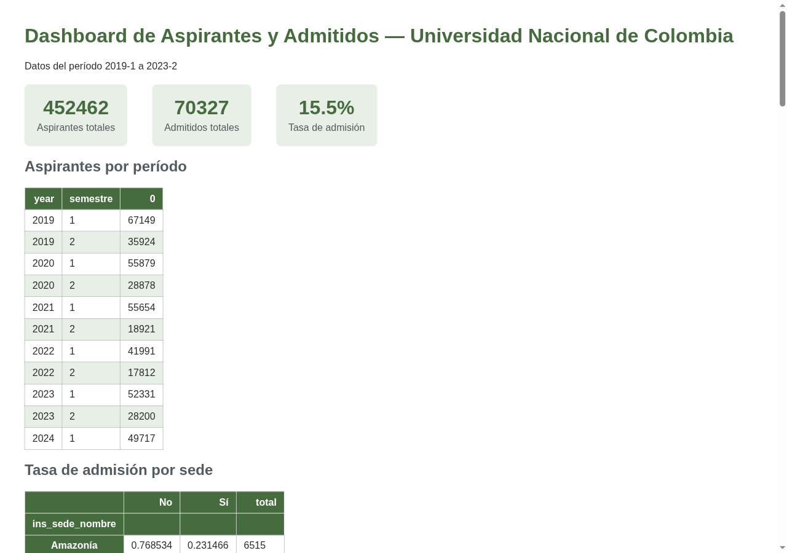
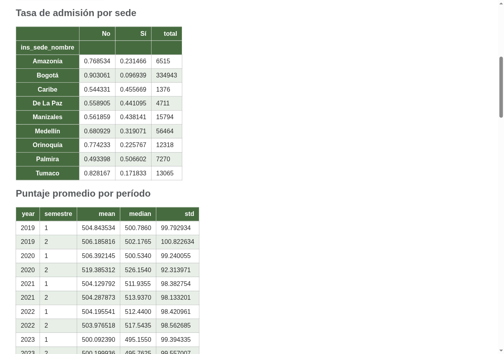
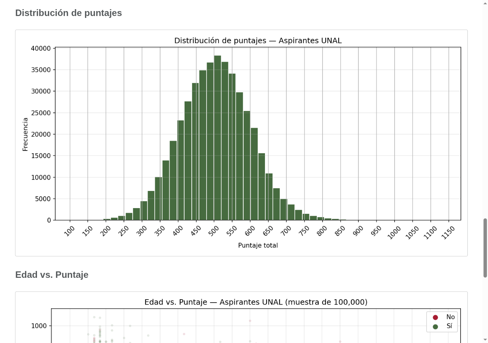
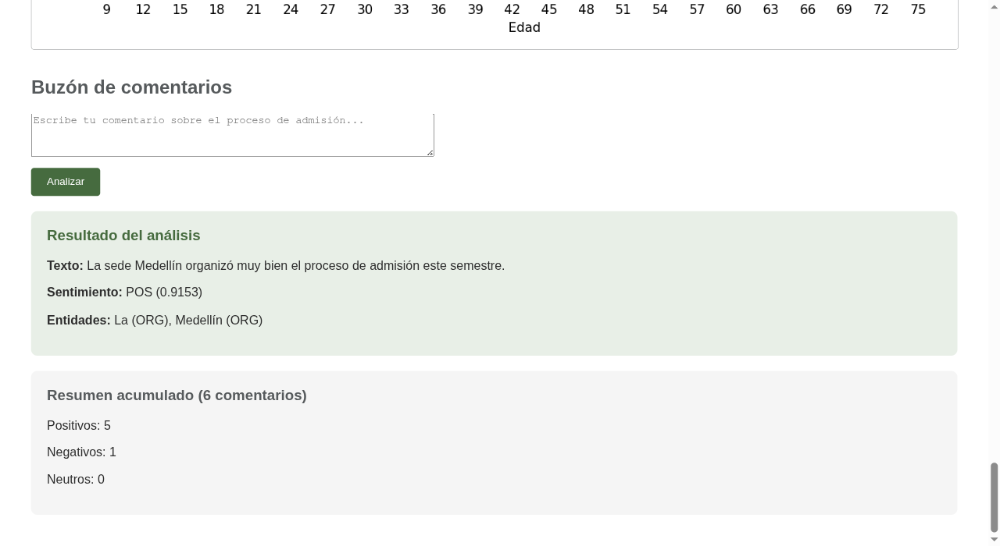

# Dashboard de Aspirantes y Admitidos — Universidad Nacional de Colombia

Aplicación web que analiza los microdatos públicos de aspirantes y admitidos de la
Universidad Nacional de Colombia y los presenta en un dashboard, con un buzón de
comentarios que aplica análisis de sentimiento y reconocimiento de entidades.

Los datos provienen del portal de datos abiertos del Estado colombiano
([datos.gov.co](https://www.datos.gov.co/resource/mqpd-2jhs.json), dataset `mqpd-2jhs`).

## Qué hace

- **Extrae** ~557.000 registros de aspirantes desde una API REST pública
- **Limpia** el dataset descartando registros inválidos (puntajes imposibles, edades en cero,
  sede sin asignar) y deja 452.462 registros útiles del período 2019–2024
- **Analiza** tasas de admisión por sede, evolución de aspirantes por período,
  distribución de puntajes y composición por nacionalidad
- **Visualiza** los resultados en un dashboard Flask con tablas y gráficas
- **Procesa** comentarios de usuarios con dos modelos de lenguaje: clasificación de
  sentimiento en español y extracción de entidades nombradas

## El dashboard

Portada con las cifras generales y las estadísticas agregadas que produce el hito 2:



Tasa de admisión por sede y evolución del puntaje por período. La brecha entre sedes es
notable: Bogotá admite al 9,7 % de sus 334.943 aspirantes, mientras Palmira supera el 50 %.



Gráficas generadas con matplotlib en el hito 2 y servidas como estáticos:



### Buzón con análisis de lenguaje

El formulario captura un comentario, lo clasifica por sentimiento, le extrae las entidades
nombradas y guarda el resultado en SQLite. El resumen acumulado se recalcula en cada envío:



## Resultados

Sobre los 452.462 registros limpios (2019–2024, 9 sedes):

| Métrica | Valor |
|---|---|
| Aspirantes | 452.462 |
| Admitidos | 70.327 |
| Tasa general de admisión | **15,5 %** |

Las tasas por sede, la serie por período y la distribución de puntajes se calculan en el
hito 2 y quedan guardadas en los CSV de estadísticas que consume el dashboard.

## Stack

| Componente | Herramienta |
|---|---|
| Extracción | `requests` sobre la API Socrata de datos.gov.co |
| Análisis | `pandas`, `scikit-learn` |
| Visualización | `matplotlib` |
| Web | `Flask` + Jinja2 |
| Persistencia | `sqlite3` |
| Sentimiento | [`pysentimiento/robertuito-sentiment-analysis`](https://huggingface.co/pysentimiento/robertuito-sentiment-analysis) |
| Entidades (NER) | [`dslim/bert-base-NER`](https://huggingface.co/dslim/bert-base-NER) |

## Estructura

```
.
├── app.py                          # Dashboard Flask + buzón con IA
├── hito_1_extraccion.ipynb         # Descarga desde la API → aspirantes_unal.csv
├── hito_2_limpieza_analisis.ipynb  # Limpieza, estadísticas y gráficas
├── stats_*.csv                     # Estadísticas precalculadas que lee el dashboard
├── capturas/                       # Capturas del dashboard en funcionamiento
├── static/                         # Gráficas generadas en el hito 2
├── templates/index.html            # Plantilla del dashboard
└── requirements.txt
```

## Cómo ejecutarlo

```bash
git clone https://github.com/JauriCortes/dashboard-aspirantes-unal.git
cd dashboard-aspirantes-unal

python -m venv .venv
source .venv/bin/activate
pip install -r requirements.txt
```

El dataset completo (68 MB) no está en el repositorio. Se regenera ejecutando el primer
notebook, que lo descarga desde la API:

```bash
jupyter notebook hito_1_extraccion.ipynb   # genera aspirantes_unal.csv
```

El segundo notebook limpia el dataset y recalcula las estadísticas y las gráficas. Los
resultados ya están versionados, así que este paso es opcional para solo levantar el
dashboard, pero es donde está el análisis:

```bash
jupyter notebook hito_2_limpieza_analisis.ipynb   # genera stats_*.csv y static/*.png
```

Con el CSV en su lugar, arranca el dashboard:

```bash
python app.py
```

Queda disponible en <http://127.0.0.1:5000>.

> El primer arranque tarda cerca de un minuto: carga el CSV en pandas y descarga los dos
> modelos de HuggingFace (~500 MB, solo la primera vez; después quedan en caché local).

## Notas técnicas

- Los CSV de estadísticas están versionados, así que el dashboard levanta sin necesidad de
  recalcular el hito 2 — pero sí requiere `aspirantes_unal.csv` para las cifras de portada.
- `dashboard.db` se crea sola al arrancar; no está versionada.
- El modelo de NER (`dslim/bert-base-NER`) está entrenado en inglés, así que sobre
  comentarios en español etiqueta de más. El de sentimiento sí es específico para español
  y se comporta bien.

## Contexto

Proyecto guiado del curso **Python con Software Libre** de la Universidad Nacional de
Colombia. Integra los cuatro módulos del curso —fundamentos y análisis de datos, manejo de
archivos y APIs, desarrollo web, e integración de modelos de IA— en una sola aplicación.

## Licencia

MIT — ver [LICENSE](LICENSE).

Los datos son públicos y pertenecen a la Universidad Nacional de Colombia, publicados bajo
los términos del portal datos.gov.co.
